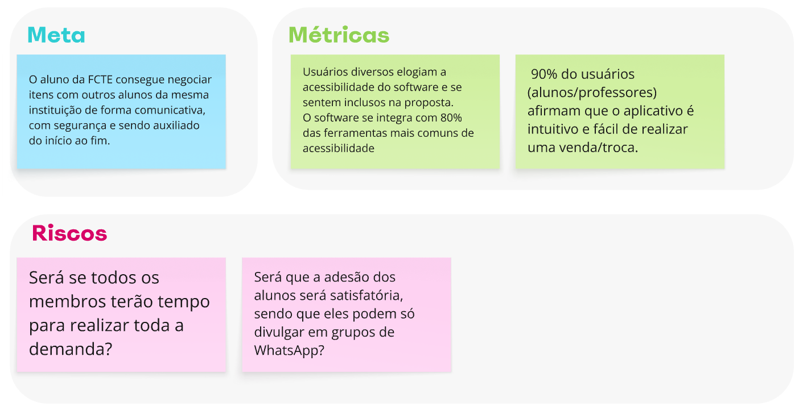
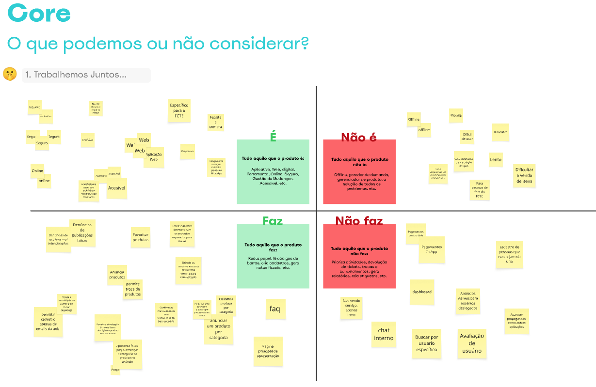
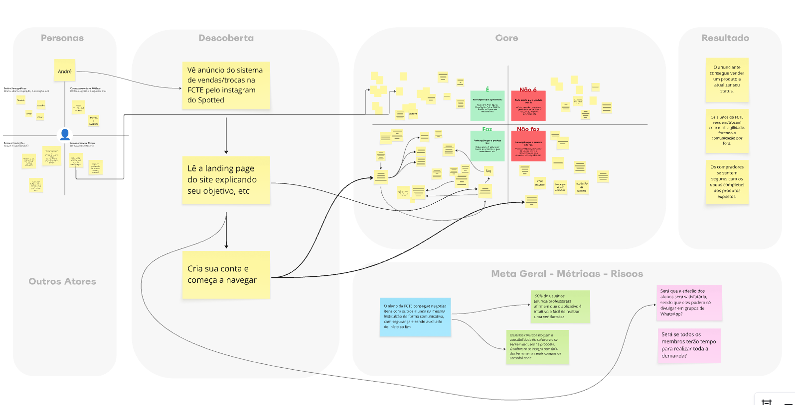

# 1.1.1. Mapping

## 1. Mapping

A etapa de *mapping* (mapeamento) foi conduzida pela equipe do projeto já no primeiro dia de execução do Design Sprint. Essa fase teve como objetivos: a definição dos papéis desempenhados pelos membros e conhecer o domínio do problema de um ponto de vista coletivo da equipe.

### 1.1 Papéis dos membros

Aqui foram estabelecidos os papéis de cada membro da equipe. Essa definição é fundamental para organizar responsabilidades e assegurar que cada parte do processo seja conduzida de forma clara.

O [Daniel Rodrigues](https://github.com/DanielRogs) assumiu o papel de **decisor** e **facilitador**, atuando como guia do processo e responsável por conduzir as atividades. Já a [Ludmila Aysha](https://github.com/ludmilaaysha) desempenhou a função de **timekeeper** e **facilitadora**, cuidando do controle do tempo e garantindo o cumprimento dos prazos de cada dinâmica. Os demais membros participaram ativamente como parte da equipe de desenvolvimento, contribuindo com ideias, votações e análises em cada etapa do Design Sprint.

### 1.2 Diretrizes adotadas

- **Tempo**: Devem ser acordados tempos, seja para cada sprint, para reuniões ou para a entrega como um todo, dentre outros planejamentos.  

- **Argumentos de venda**: Devem ser definidos argumentos que permitam evidenciar o valor do que está sendo proposto. Esse valor pode estar relacionado ao mercado, mas também pode ter correlação com ganhos sociais, de aprendizado, entre outros, quando o projeto não envolver valores financeiros ou vendas diretas.  

- **Foco na entrega**: Os envolvidos devem manter foco na entrega. Multitarefas que interrompam constantemente o fluxo não são desejadas, pois atrapalham o progresso e comprometem o cumprimento dos prazos.  

- **Arrisque – “O inimigo do bom é o ótimo”**: Devem ser estimuladas iniciativas, ainda que não estejam 100% corretas ou perfeitas. O mais importante é começar. Erros fazem parte do processo.  

### 1.3 Basics (fundamentos básicos)

Durante a etapa de Mapping, é fundamental identificar e definir as ideias que descrevem, caracterizam e diferenciam o projeto. Com esse objetivo, a equipe de desenvolvimento realizou uma dinâmica envolvendo sugestões, votação anônima e alinhamentos finais, para determinar quais metas, métricas e riscos são mais relevantes para o contexto. A seguir, apresentam-se os resultados desse processo:

#### 1.3.1 Meta

Foi estabelecido pela equipe que a solução tem como principal objetivo permitir que um aluno da FCTE consiga negociar itens com outros alunos da mesma instituição de forma comunicativa, com segurança e sendo auxiliado do início ao fim.

#### 1.3.2 Métricas

Foram definidas duas métricas principais para o projeto, sendo elas:

- Usuários diversos elogiam a acessibilidade do software e se sentem inclusos na proposta. O software se integra com 80% das ferramentas mais comuns de acessibilidade.

- 90% do usuários (alunos/professores) afirmam que o aplicativo é intuitivo e fácil de realizar uma venda/troca.

#### 1.3.3 Riscos

Foram definidos dois riscos principais que envolvem o projeto, sendo eles:

- Será que todos os membros terão tempo para realizar toda a demanda?

- Será que a adesão dos alunos será satisfatória, sendo que eles podem só divulgar em grupos de WhatsApp?

### 1.4 Map

A etapa de *Map* é o momento em que os projetistas identificam os elementos que contribuirão para alcançar os objetivos previamente estabelecidos, definem o público-alvo da solução de software em desenvolvimento e destacam os pontos cruciais identificados até o momento. Nesse contexto, as informações foram organizadas e desenvolvidas da seguinte forma:

#### 1.4.1 Reflexão interna

> Como alcançar nossos objetivos?

Com o objetivo de explicitar quais práticas tornarão viável atingir os objetivos estimados, a equipe elencou, votou e chegou a conclusão em cima dos seguintes pontos:

- Um membro do grupo ao se deparar com um obstáculo em uma task, deve levar a dificuldade ao grupo nas reuniões, para que assim possa ser auxiliado e o grupo não venha a ser prejudicado.

- Os membros devem estar por dentro do cronograma e, caso tenham dificuldades em entregar algo, devem comunicar ao líder para que haja uma redistribuição das tarefas.

- Podemos utilizar a divulgação constante através das redes sociais (mais especificamente através do perfil no Instagram [@spottedmiltonfcte](https://www.instagram.com/spottedmiltonfcte/)).

#### 1.4.2 Público-alvo (personas)

> Quais são os tipos de público que atenderemos?

Com o objetivo de identificar características de quem será destinado à solução de software em questão, a equipe elencou a seguinte persona e suas características (dados fictícios):

- André, 23 anos, estudante e estagiário;
- André gosta de jogos, computador, música e guitarra;
- André tem medo de realizar compra de itens usados, pois não se sente seguro no momento da troca ou pelo preço;
- André gostaria de vender ou trocar alguns de seus itens, além de comprar produtos de seu gosto por preços acessíveis.

#### 1.4.3 Descoberta

> Como o público descobre essa novidade?

Baseado em todas as discussões realizadas entre os membros até este momento, foram listados os seguintes fatores que podem contribuir para o público descobrir nosso produto:

- Focar em anúncios em perfis de Instagram da FCTE;
- Landing page explicando o principal objetivo;
- Incentivar criação de contas para conhecer mais da plataforma.

#### 1.4.4 Core

> O que podemos ou não considerar?

Em seguida, a equipe preencheu a matriz **Core**, definindo que:

- **O software é**: uma plataforma web responsiva de vendas e trocas de itens para alunos.

- **O software não é**: um aplicativo mobile, offline e que dificulta a vendas e trocas entre alunos.

- **O software faz**: permite que alunos anunciem, comprem e troquem produtos usados entre si.

- **O software não faz**: não faz transações/pagamentos internos e não aceita cadastro de pessoas que não sejam da UnB.

#### 1.4.5 Resultados Esperados

Por fim, a equipe definiu os resultados esperados no final da etapa do *Map*, que são eles:

- O anunciante consegue vender um produto e atualizar seu status;
- Os alunos da FCTE vendem/trocam com mais agilidade, fazendo a comunicação por fora;
- Os compradores se sentem seguros com os dados completos dos produtos expostos.

## Histórico de Versões
| Versão | Data | Descrição | Autor(es) | Revisor(es) | Detalhes da Revisão |
| -- | -- | -- | -- | -- | -- |
| 1.0 | 04/09/2025 | Documentação da etapa Mapping | [Lucas Guimarães](https://github.com/lcsgborges) | [Davi Camilo](https://github.com/Davicamilo23) | 04/09/2025 |
| 1.1 | 04/09/2025 | Pequenas correções no artefato | [Davi Camilo](https://github.com/Davicamilo23) | [Lucas Guimarães](https://github.com/lcsgborges) | 04/09/2025 |
