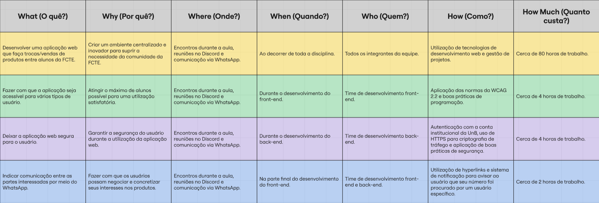

# Sketch

## O que é a fase de Sketch?

A fase de Sketch (Esboço), tradicionalmente, foca na geração individual de ideias e soluções visuais para o problema definido no sprint. O objetivo é estimular a criatividade de cada participante, que de forma independente, desenha propostas para responder à questão central do sprint. Essa abordagem garante uma variedade de soluções sem a interferência ou o viés inicial do grupo.

No contexto do nosso projeto **AquiTemFCTE**, adaptamos a fase de Sketch de forma estratégico para produzir uma série de artefatos generalistas que são fundamentais para a compreensão aprofundada do problema e a construção da solução. Essa adaptação nos permitiu documentar as análises e decisões iniciais da equipe, servindo como base para as fases subsequentes do desenvolvimento.

Os artefatos gerados nesta fase contribuem para uma visão abrangente do cenário, desde a identificação das causas-raiz até a definição de termos e conceitos importantes para o projeto. Abaixo, são apresentados os principais artefatos desenvolvidos durante essa etapa:

## Glossário

### Domínio do Problema

#### Aluno
[Usuário](#usuário) que estuda no campus [FCTE](#fcte).

#### Anúncio / Publicação
Página ou registro que apresenta a [oferta](#oferta), com descrição, fotos e preço ou condições de [troca](#troca).

 
#### Avaliação
Feedback ou nota dada pelo [comprador ou trocador](#comprador) após a transação.

 

 
#### Categoria
Classificação do [produto](#produto) (ex.: livros, eletrônicos, roupas, acessórios).

 
<!-- #### Chat
 Canal de comunicação interna entre [usuários](#usuário) para negociar [vendas](#venda) ou [trocas](#troca).

  -->
#### Checkout
Processo de finalização de [compra](#compra) ou [troca](#troca), incluindo confirmação de troca.

 
#### Compra
Transação em que um [produto](#produto) é adquirido por um valor em dinheiro.

 
#### Comprador ou trocador
[Usuário](#usuário) que adquire um [produto](#produto) em um processo de [venda](#venda) ou [troca](#troca).

#### Favoritos
Local em que o [usuário](#usuário) adiciona produtos que deseja comprar.
 
#### FCTE
Faculdade de Ciências e Tecnologia em Engenharia, campus da UnB em que o [sistema](#sistema) será utilizado.

 
#### Histórico de vendas/trocas
Registro das transações concluídas pelo [usuário](#usuário), incluindo informações sobre [produtos](#produto) [vendidos](#venda) ou [trocados](#troca), datas e respectivas [avaliações](#avaliação).

#### Intuitivo
Refere-se a algo fácil de entender e usar, que não exige esforço cognitivo para aprender. Normalmente associado a interfaces simples e claras.

#### Minimalista
Estilo de design que prioriza simplicidade, clareza e apenas os elementos essenciais, evitando excessos.
 
#### Notificação
Mensagem enviada ao [usuário](#usuário) sobre novas [ofertas](#oferta).

 
#### Oferta
[Produto](#produto) publicado pelo [usuário](#usuário) para [venda](#venda) ou [troca](#troca).

 
#### Pagamento
Método pelo qual o [usuário](#usuário) transfere dinheiro pelo [produto](#produto) (se houver).

 
#### Perfil
Página do [usuário](#usuário) com informações básicas, [histórico de vendas/trocas](#histórico-de-vendastrocas) e [avaliações](#avaliação).

 
#### Produto
Item que um [aluno](#aluno) deseja [vender](#venda) ou [trocar](#troca).

 
#### Troca
Transação em que [produtos](#produto) são trocados entre [alunos](#aluno) sem pagamento em dinheiro.

 

#### Usuário
Qualquer pessoa cadastrada no [sistema](#sistema) (aluno, administrador, etc.).

 
#### Venda
Transação em que um [produto](#produto) é oferecido por um valor em dinheiro.

---

### Domínio Técnico

#### Acessível
Qualidade de um sistema, site ou aplicativo que pode ser usado por todas as pessoas, incluindo aquelas com deficiência (visual, auditiva, motora ou cognitiva).

#### API
Conjunto de regras e *endpoints* para comunicação entre [frontend](#frontend) e [backend](#backend).

 
#### Aplicação
Software que permite a interação entre os [alunos](#aluno) para realizar [vendas](#venda) e [trocas](#troca).

 
#### Autenticação
Processo de verificar a identidade do [usuário](#usuário) (login, senha, OAuth).

 
#### Autorização
Processo de verificar se o [usuário](#usuário) tem permissão para acessar determinada função ou recurso.

 
#### Backend
Parte do [software](#software) que processa dados, lógica de negócios e comunicação com [banco de dados](#banco-de-dados).

 
#### Banco de Dados
Local onde são armazenadas informações do [sistema](#sistema) (usuários, produtos, transações).

 
#### CRUD
Operações básicas do [sistema](#sistema): Create, Read, Update, Delete (Criar, Ler, Atualizar, Apagar).

 
#### Deploy
Publicação da [aplicação](#aplicação) em um [servidor](#servidor) para uso dos [usuários](#usuário).

#### FAQ (Perguntas Frequentes)
Seção de perguntas frequentes onde se reúnem dúvidas comuns dos [usuários](#usuário), junto com suas respostas.

 
#### Frontend
Parte do [software](#software) que interage com o [usuário](#usuário) (interface).

 
#### Paginação
Técnica para dividir listas longas de [produtos](#produto) em páginas menores para melhor visualização.

 
#### Responsividade
 Capacidade da interface de se adaptar a diferentes dispositivos (desktop, tablet, celular).

 
#### Search / Filtro
Funcionalidade de busca e filtragem de [produtos](#produto) por [categoria](#categoria), preço ou palavras-chave.

 
#### Servidor
Computador ou sistema responsável por hospedar serviços, aplicações ou dados, permitindo o acesso remoto por clientes (usuários ou dispositivos). É onde a [aplicação](#aplicação) será disponibilizada para acesso pelos [alunos](#aluno).

 
#### Session / Token
Mecanismo que mantém o [usuário logado](#autenticação) e autentica suas requisições.

 
#### Sistema
Refere-se ao ambiente completo que possibilita a comunicação e as transações entre os [usuários](#usuário).

 
#### Upload
Ação de enviar arquivos (fotos de produtos) para o [servidor](#servidor).

#### Web
Conjunto de páginas, serviços e aplicativos acessados pela internet por meio de navegadores.

Os detalhes sobre o processo de desenvolvimento deste Glossário, incluindo a metodologia de colaboração e a justificativa para a escolha de cada termo, estão documentados no tópico [1.2.1. Glossário](/Base/1.2.1.Glossario.md). Lá, você encontrará a análise completa que serviu como base para a criação deste artefato, explicando como os termos de domínio do problema e técnico foram selecionados para garantir uma linguagem unificada para a equipe.

## Diagrama de Ishikawa

  <iframe loading="lazy" style="position: absolute; width: 100%; height: 100%; top: 0; left: 0; border: none; padding: 0;margin: 0;"
    src="https://www.canva.com/design/DAGxrmTmKyQ/qqG6JT8aMqrORd5OdtH30Q/view?embed" allowfullscreen="allowfullscreen" allow="fullscreen">
  </iframe>

Figura 1:
<a href="https:&#x2F;&#x2F;www.canva.com&#x2F;design&#x2F;DAGxrmTmKyQ&#x2F;qqG6JT8aMqrORd5OdtH30Q&#x2F;view?utm_content=DAGxrmTmKyQ&amp;utm_campaign=designshare&amp;utm_medium=embeds&amp;utm_source=link" target="_blank" rel="noopener">Diagrama de Ishikawa Definitivo</a>

Os detalhes sobre o processo de desenvolvimento deste Diagrama de Ishikawa, que incluiu uma fase individual e uma etapa de convergência de ideias, estão documentados no tópico [1.2.2. Diagrama de Ishikawa](/Base/1.2.2.DiagramaIshikawa.md). Neste tópico, você poderá aprofundar a análise de cada causa-raiz, entender o senso crítico da equipe e as justificativas que levaram à sua consolidação, além de uma reflexão sobre a colaboração na sua construção.

## 5W2H

Figura 2: Tabela 5W2H 

Os detalhes sobre o processo de desenvolvimento do 5W2H, incluindo uma explicação do método e da metodologia adotada, estão documentados no tópico [1.2.4. 5W2H](/Base/1.2.4.5W2H.md). A partir deste tópico, será possível compreender as ideias aplicadas na construção do artefato, que incluíram os pontos principais escolhidos para serem trabalhados no projeto.

## Léxico

| **Termo** | **Noção** | **Impacto** | **Sinônimos** |
|-----------|-----------|--------------|---------------|
| Cadastro | Processo inicial de criação de uma conta na plataforma. | Define quem pode entrar na comunidade, garantindo que apenas alunos da FCTE tenham acesso. É a porta de entrada para o sistema. | Registro, Inscrição |
| Anúncio | Registro público de um produto oferecido por um usuário. | Disponibiliza produto para compra, venda ou troca; aparece em buscas e categorias. | Oferta, Publicação |
| Perfil | Seção pessoal do usuário onde ficam armazenadas suas informações, anúncios ativos, histórico de transações e produtos favoritados. | Centraliza a identidade e a atividade do usuário na plataforma. | Área do usuário |
| Página Principal | Tela inicial que apresenta o serviço, destaca produtos, exibe categorias e fornece os principais acessos ao sistema. | É o primeiro ponto de contato do usuário com a plataforma, sendo fundamental para a clareza e navegação. | Tela Principal |
| Categoria | Classificação atribuída a um produto (ex.: livros, eletrônicos, serviços). | Facilita a organização e a busca de itens. | Seção, Grupo |
| Comunidade FCTE | Conjunto de estudantes vinculados ao campus FCTE da UnB. | Define o público-alvo e restringe o acesso exclusivo à plataforma. | Corpo discente FCTE |
| Compra | Ação de adquirir um produto mediante pagamento acordado. | Gera registro de transação e altera status do produto. | Aquisição |
| Estudante | Integrante da comunidade acadêmica da FCTE que utiliza a plataforma. | Define o público-alvo do sistema e é quem realiza as ações de anunciar, comprar, vender e interagir na plataforma. | Aluno, Usuário verificado |
| Produto | Item novo ou usado disponível para compra, venda ou troca. | É cadastrado com informações de título, descrição, preço (quando aplicável) e categoria. | Item, Mercadoria |
| Transação | Processo de compra, venda ou troca entre dois usuários. | Envolve confirmação entre comprador e vendedor; é registrada no sistema. | Negócio |
| Troca | Modalidade de transação em que um produto é ofertado em permuta por outro. | Não envolve pagamento direto, mas requer acordo entre as partes. | Mútuo acordo |
| Usuário | Pessoa que acessa a plataforma, podendo comprar, vender ou trocar produtos. | Pode criar conta, acessar perfil, anunciar itens e interagir em transações. | Estudante, Membro |
| Venda | Ação de disponibilizar um produto para ser adquirido por outro estudante. | Requer cadastro de produto e gera histórico no perfil do vendedor. | Comercialização |
| Denúncia | Ação de sinalizar conteúdo ou usuários inapropriados (publicações falsas, usuários mal-intencionados). | Permite moderação, aumenta a segurança e a confiança da comunidade. | Report, Reclamação, Queixa |
| Moderação | Processo (manual ou automático) de analisar denúncias e aplicar medidas (remoção de anúncio, suspensão de usuário). | Mantém a integridade da plataforma, reforça as políticas de uso e reduz fraudes. | Revisão |
| Verificação de Identidade | Confirmação de que um usuário pertence à Comunidade FCTE. | Restringe o acesso ao público-alvo, aumenta a segurança e a confiabilidade das transações. | Autenticação, Validação |
| Descrição | Texto detalhado que explica o estado de conservação, as características e outras informações relevantes do produto anunciado. | Evita mal-entendidos e fornece ao comprador os detalhes necessários para tomar uma decisão de compra ou troca. | Informações |
| Favorito | Ação de marcar um produto ou anúncio de interesse para fácil acesso posterior em uma lista pessoal. | Melhora a descoberta e a retenção de usuários; funciona como um indicador de interesse no produto. | Salvar lista de |
| Reputação | Sistema de avaliação mútua entre compradores e vendedores após a conclusão de uma transação. | É crucial para a confiança na plataforma, ajudando futuros usuários a decidir. | Avaliação, Rating |
| Confirmação de Transação | Procedimento manual para que os envolvidos confirmem que a venda ou a troca foi concluída com sucesso. | Atualiza o status do produto para "vendido/trocado", alimenta o histórico do usuário e pode servir como base para o sistema de reputação. | Validação de conclusão |
| Foto | Arquivo de imagem que acompanha o anúncio para representar visualmente o produto. | Aumenta a confiança do comprador e a chance de conversão da oferta, permitindo uma avaliação visual do item. | Imagem do anúncio |

Os detalhes sobre o processo de desenvolvimento do Léxico Ampliado da Linguagem (LAL), incluindo uma explicação do método e da metodologia adotada, estão documentados no tópico [1.2.5. Léxico](/Base/1.2.5.Léxico.md).Esse tópico fornece a base para entender as concepções aplicadas na elaboração do artefato, destacando os aspectos principais selecionados para desenvolvimento no projeto.

## Rich Picture

  <iframe loading="lazy" style="position: absolute; width: 100%; height: 100%; top: 0; left: 0; border: none; padding: 0;margin: 0;"
    src="https://www.canva.com/design/DAGxgo3_dwg/fUjcaZdRc3VaBchijvDGuw/view?embed" allowfullscreen="allowfullscreen" allow="fullscreen">
  </iframe>

    Figura 3:
    <a href="https:&#x2F;&#x2F;www.canva.com&#x2F;design&#x2F;DAGxgo3_dwg&#x2F;fUjcaZdRc3VaBchijvDGuw&#x2F;view?utm_content=DAGxgo3_dwg&amp;utm_campaign=designshare&amp;utm_medium=embeds&amp;utm_source=link" target="_blank" rel="noopener">
        Rich Picture
    </a>

Os detalhes sobre o desenvolvimento deste Rich Picture, utilizado como uma modelagem visual simples e colaborativa, estão documentados no tópico [1.2.3. Rich Picture](/Base/1.2.3.RichPicture.md). Nele, é possível observar como rascunhos e anotações rápidas auxiliaram no levantamento de requisitos e no alinhamento de percepções da equipe, reforçando sua utilidade tanto em fases iniciais quanto em etapas de projeto e design.

## Histórico de Versões

| Versão | Data | Descrição | Autor(es) | Revisor(es) | Detalhes da Revisão |
| -- | -- | -- | -- | -- | -- |
| 1.0 | 31/08/2025 | Criação do Documento e desenvolvimento do Tópico | [Daniel Rodrigues](https://github.com/DanielRogs) | [Lucas Guimarães](https://github.com/lcsgborges) | 31/08/2025 |
| 1.1 | 31/08/2025 | Correções de Hyperlinks | [Daniel Rodrigues](https://github.com/DanielRogs) | [Ludmila Aysha](https://github.com/ludmilaaysha) | 31/08/2025 |
| 1.2 | 01/09/2025 | Adicionando Rich Picture | [Eric Rabelo](https://github.com/rabelzx) | [Algusto Caldas](https://github.com/Algusto-RC) | 01/09/2025 |
| 1.3 | 01/09/2025 | Adição do 5W2H | [Davi Camilo](https://github.com/Davicamilo23) | [Daniel Rodrigues](https://github.com/DanielRogs) | 01/09/2025 |
| 1.4 | 01/09/2025 | Pequenas mudanças no texto do 5W2H | [Davi Camilo](https://github.com/Davicamilo23) | [Daniel Rodrigues](https://github.com/DanielRogs) | 01/09/2025 |
| 1.5 | 01/09/2025 | Adicionando Léxico | [Felipe Campelo](https://github.com/felipeacampelo) | [Igor Justino](https://github.com/IgorJustino) | 03/09/2025 |
