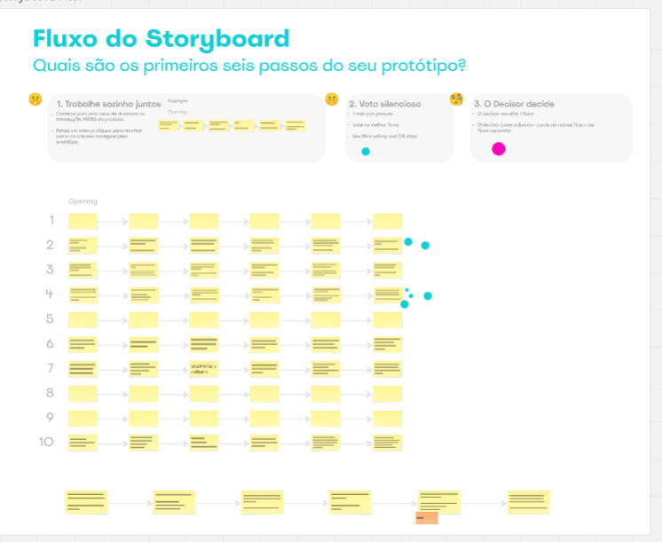
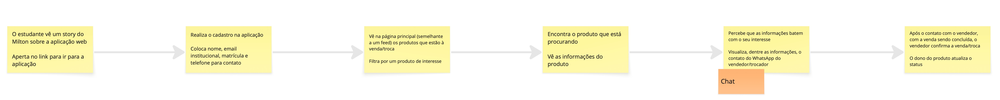

# Design Sprint – Etapa 3: Decide

Durante a terceira etapa da Design Sprint "Decide", nossa equipe se concentrou em analisar e priorizar as soluções que melhor atendem às necessidades da comunidade acadêmica do Campus FCTE. O objetivo do projeto AquiTemFCTE é criar uma plataforma segura e confiável para compra, venda e troca de itens entre estudantes, facilitando a interação e reduzindo dificuldades enfrentadas na busca por canais de negociação dentro do campus.

## O que fizemos

##### 1. Revisão das ideias geradas  
Inicialmente, revisamos todas as soluções propostas na etapa anterior (Sketch), que incluíam funcionalidades como:  

- Cadastro e verificação de usuários da comunidade FCTE;  
- Pesquisa e filtragem de produtos por categoria, preço e condição;  
- Sistema de compra, venda e troca de itens entre estudantes;   

##### 2. Discussão em equipe  
Discutimos coletivamente os pontos fortes e limitações de cada proposta e o que melhor representava o projeto, avaliando:  

- A relevância de cada funcionalidade para solucionar os problemas identificados;  
- A viabilidade técnica e recursos necessários para implementação;  
- Clareza e simplicidade da funcionalidade.

##### 3. Votação das ideias  
Para organizar e consolidar as ideias, cada integrante trouxe seus pontos de vista sobre quais funcionalidades deveriam ser priorizadas. A equipe então votou para decidir o foco principal, levando em consideração o impacto no usuário e a complexidade de implementação.

##### 4. Decisão final baseada no artefato escolhido  
O **Diagrama de Ishikawa (Fishbone Diagram)** foi adotado como referência para orientar a decisão final. 

  <iframe loading="lazy" style="position: absolute; width: 100%; height: 100%; top: 0; left: 0; border: none; padding: 0;margin: 0;"
    src="https://www.canva.com/design/DAGxrmTmKyQ/qqG6JT8aMqrORd5OdtH30Q/view?embed" 
    allowfullscreen="allowfullscreen" allow="fullscreen">
  </iframe>

  <small>Figura 1: Diagrama de Ishikawa mostrando as causas-raiz dos problemas de negociação no campus FCTE</small>

Essas decisões garantem que a plataforma atenda às necessidades mais críticas da comunidade acadêmica e estabeleçam prioridades claras para o desenvolvimento do projeto.

---

## Justificativas e Senso Crítico  
A aplicação do Diagrama de Ishikawa foi essencial para aprofundar a compreensão sobre os problemas enfrentados pelos estudantes do Campus FCTE. Permitindo ir além da simples constatação de que "não existe uma plataforma", a análise destrinchou as causas-raiz que justificam a necessidade de um projeto como o AquiTemFCTE.  

A metodologia de análise individual seguida pela convergência de ideias garantiu que diferentes perspectivas fossem consideradas, resultando em um consenso bem fundamentado.  

O Fishbone Diagram não apenas justificou a existência do projeto, mas também serviu como guia estratégico para o desenvolvimento, direcionando o foco para as áreas mais críticas e assegurando que cada decisão de design e arquitetura esteja alinhada à resolução das causas-raiz identificadas.

---

## Storyboard Flow

Durante a fase de Decide, a equipe também trabalhou na definição dos **seis primeiros passos do usuário** no protótipo do AquiTemFCTE. Cada integrante do grupo propôs individualmente sua própria sequência de ações, considerando como seria a primeira experiência de um estudante ao utilizar a plataforma.

Após a apresentação de todas as propostas, realizamos uma votação para escolher a opção que melhor representasse o fluxo inicial do usuário, considerando critérios como:  

- Clareza e simplicidade da navegação;  
- Relevância das ações para o objetivo principal do protótipo;  
- Facilidade de compreensão para novos usuários.  

<small>Figura 2: Fluxo completo do Storyboard do AquiTemFCTE</small>

A opção vencedora foi adotada como referência para a construção do storyboard, servindo de guia visual para o desenvolvimento do protótipo e garantindo que a experiência inicial do usuário fosse intuitiva e eficiente.

<small>Figura 3: Opção vencedora de Storyboard Flow do AquiTemFCTE</small>

##  Comentários sobre o Trabalho em Equipe  
A fase de decisão evidenciou a colaboração efetiva de todos os integrantes. Cada membro contribuiu com ideias, análise crítica e sugestões de melhorias.  

O processo de análise do Fishbone Diagram e a discussão coletiva permitiram que todos os pontos de vista fossem considerados e que as decisões fossem tomadas de forma democrática e alinhada aos objetivos do projeto.  

O trabalho conjunto resultou em decisões bem fundamentadas, com foc

---

## Histórico de Versões
| Versão | Data | Descrição | Autor(es) | Revisor(es) | Detalhes da Revisão |
| -- | -- | -- | -- | -- | -- |
| 1.0 | 03/09/2025 | Criação do documento | [Felipe Campelo](https://github.com/felipeacampelo) | | |
| 1.1 | 04/09/2025 | Adição do Storyboard Flow | [Felipe Campelo](https://github.com/felipeacampelo) | | |
| 1.2 | 04/09/2025 | Adição de imagem completa do fluxo de Storyboard Flow | [Felipe Campelo](https://github.com/felipeacampelo) | | |

