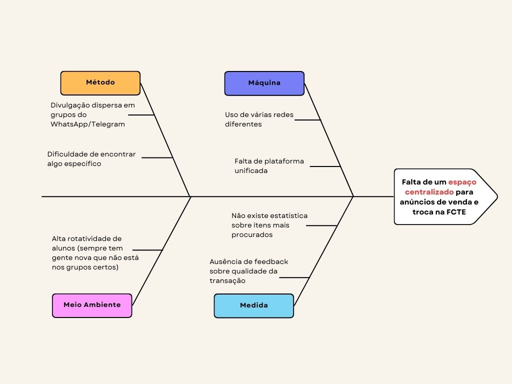

# 1.2.2. Diagrama Ishikawa

## Introdução

O Diagrama de Ishikawa, também conhecido como Diagrama de Causa-Efeito, é uma ferramenta visual fundamental para a análise de causa-raiz. Sua estrutura, em forma de peixe, permite organizar e categorizar as diversas causas que contribuem para um problema específico. Em resumo ele nos ajuda a ir além dos sintomas e identificar as verdadeiras origens de uma falha ou ineficiência em determinado contexto real. No contexto do projeto **AquiTemFCTE**, plataforma digital voltada para a comunidade universitária da Universidade de Brasília (UnB) no Campus Faculdade de Ciências e Tecnologias em Engenharia (FCTE), a utilização deste diagrama nos permite analisar as necessidades reais sob a perspectiva dos estudantes. Com isso, o desenvolvimento da plataforma pode ser direcionado para solucionar as causas-raiz do problema, evitando o foco em funcionalidades que não contribuem efetivamente para essa resolução.

## Metodologia

A construção do Diagrama de Ishikawa foi realizada, primeiramente de forma individual e posteriormente de forma colaborativa para a convergência de ideias. O processo metodológico seguiu as seguintes etapas:

1. **Análise dos documentos da Design Sprint**: Foram revisados os materiais produzidos durante a [Design Sprint](/Base/1.1.DesignSprint.md) da disciplina Arquitetura e Desenho de Software (UnB – 2025.2), identificando objetivos e problemas levantados durante a fase de Mapping, que fez parte das discussões iniciais.

2. **Fase individual para então convergir as ideias**: Após a fase individual de análise, onde cada participante elaborou seu próprio Diagrama de Ishikawa para mapear as causas e problemas percebidos no Campus UnB/FCTE, o grupo iniciou a etapa de convergência de ideias. Nessa fase colaborativa, os diagramas foram comparados e discutidos, resultando na criação de um único artefato consolidado, que representa o consenso do grupo sobre as verdadeiras causas-raiz a serem abordadas pelo projeto.

## Participantes
Os participantes da elaboração do artefato estão descritos na Tabela 1 abaixo.

Tabela 1: Participantes da elaboração do Diagrama de Ishikawa

| Matrícula   | Aluno             |
| ----------- | ----------------- |
| 21/1061583  | Daniel Rodrigues  |
| 22/2015159  | Lucas Guimarães   |

## Diagrama de Ishikawa

### Ishikawa Individual de Lucas Guimarães

O diagrama a seguir, representada pela Figura 1, representa a análise individual de Lucas Guimarães, que buscou mapear as principais causas para o problema central: **A falta de um espaço centralizado para anúncios de venda e troca na FCTE**. As causas foram categorizadas em "Método", "Meio Ambiente", "Máquina" e "Medida", oferecendo uma visão inicial sobre os desafios enfrentados pela comunidade estudantil.

Figura 1: Diagrama de Ishikawa por Lucas

#### Causas em Método:
- Divulgação dispersa em grupos do WhatsApp/Telegram;
- Dificuldade de encontrar algo específico;

#### Causas em Meio Ambiente:
- Alta rotatividade de alunos (sempre tem gente nova que não está nos grupos certos);

#### Causas em Máquina:
- Uso de várias redes diferentes;
- Falta de plataforma unificada;

#### Causas em Medida:
- Não existe estatística sobre itens mais procurados;
- Ausência de feedback sobre qualidade da transação;

### Ishikawa Individual de Daniel Rodrigues

O diagrama de Daniel Rodrigues, representado pela Figura 2, foca na causa central da **Falta de centralidade para comercialização e troca de itens exclusivo aos alunos da UnB/FCTE de forma segura**. Ele detalha os problemas percebidos em seis categorias, que incluem desde questões de logística e comunicação até a ausência de mecanismos de segurança e mensuração.

  <iframe loading="lazy" style="position: absolute; width: 100%; height: 100%; top: 0; left: 0; border: none; padding: 0;margin: 0;"
    src="https://www.canva.com/design/DAGxkA9bBGA/0p_p55HDcmGaUJKxRWcJ3g/view?embed" allowfullscreen="allowfullscreen" allow="fullscreen">
  </iframe>

Figura 2:
<a href="https:&#x2F;&#x2F;www.canva.com&#x2F;design&#x2F;DAGxkA9bBGA&#x2F;0p_p55HDcmGaUJKxRWcJ3g&#x2F;view?utm_content=DAGxkA9bBGA&amp;utm_campaign=designshare&amp;utm_medium=embeds&amp;utm_source=link" target="_blank" rel="noopener">Diagrama Ishikawa por Daniel</a>

#### Causas em Venda:
- Falta de padronização na descrição dos produtos;
- Dificuldade na logística de entrega/retirada do produto;
- Falta de opção de entrega ou facilitada no campus;
- Horários incompatíveis entre as partes;
- Anúncios se perdem em grupos de WhatsApp e redes sociais;
- Dificuldade em se destacar entre outros vendedores;

#### Causas em Método:
- Perda de tempo gerenciando diferentes plataformas;
- Riscos de golpes e fraudes;
- Dificuldade de atingir somente alunos da UnB/FCTE;
- Demanda por múltiplos acessos e cadastros;
- Ausência de reputação dos compradores/vendedores;

#### Causas em Ambiente:
- Dificuldade de encontro fora do horário de aula;
- Dificuldade de atingir o público-alvo certo;
- Informações se perdem em grupos genéricos;
- Preocupação com segurança pessoal, já que nem todas as vendas são no campus UnB;
- Falta de cultura de reuso dentro da universidade;

#### Causas em Segurança:
- Pessoas mal-intencionadas se aproveitando da descentralização;
- Ausência de sistema de avaliação e reputação;
- Falta de mecanismo para verificar a identidade do usuário;
- Necessidade de compartilhar informações privadas para contato;
- Anúncios falsos ou produtos adulterados;

#### Causas em Troca:
- Dificuldade em negociar o valor de troca de itens de diferentes categorias;
- Falta de visibilidade dos itens disponíveis para troca;
- Riscos de desistência ou não cumprimento do combinado;
- Processo manual de busca e negociação de trocas;

#### Causas em Medida:
- Dificuldade de encontrar os produtos mais procurados;
- O modelo descentralizado não suporta grande volume de usuários;
- Impossibilidade de melhorar o processo sem saber o que funciona e o que não funciona;
- Não há dados sobre o volume de transações;
- Dificuldade de filtrar por produtos;

### Ishikawa Oficial com a convergência de ideias

Este diagrama representa o resultado da fase colaborativa, na qual as análises individuais foram debatidas e consolidadas em um único artefato. As causas a seguir representam o consenso do grupo sobre os principais problemas que a plataforma **AquiTemFCTE** deve abordar para oferecer um serviço seguro e eficiente à comunidade da UnB/FCTE.

  <iframe loading="lazy" style="position: absolute; width: 100%; height: 100%; top: 0; left: 0; border: none; padding: 0;margin: 0;"
    src="https://www.canva.com/design/DAGxrmTmKyQ/qqG6JT8aMqrORd5OdtH30Q/view?embed" allowfullscreen="allowfullscreen" allow="fullscreen">
  </iframe>

Figura 3:
<a href="https:&#x2F;&#x2F;www.canva.com&#x2F;design&#x2F;DAGxrmTmKyQ&#x2F;qqG6JT8aMqrORd5OdtH30Q&#x2F;view?utm_content=DAGxrmTmKyQ&amp;utm_campaign=designshare&amp;utm_medium=embeds&amp;utm_source=link" target="_blank" rel="noopener">Diagrama de Ishikawa Definitivo</a>

#### Causas em Venda:
- Dificuldade na logística de entrega e retirada do produto;
- Gastos com frete e falta de opção facilitada de entrega no campus;
- Horários incompatíveis entre as partes;
- Dificuldade em se destacar entre outros vendedores;
- Anúncios se perdem em grupos de WhatsApp/Telegram e redes sociais;

#### Causas em Método:
- Divulgação e comunicação dispersa em grupos e redes sociais;
- Dificuldade em atingir somente o público-alvo da UnB/FCTE;
- Dificuldade de encontrar algo específico;
- Processo manual de busca e negociação de trocas.

#### Causas em Ambiente:
- Dificuldade de encontro fora do horário de aula e em pontos seguros;
- Informações que se perdem em grupos genéricos;
- Falta de cultura de reuso dentro da universidade;
- Alta rotatividade de alunos, o que dificulta o alcance de novos usuários;
- O modelo descentralizado não suporta um grande volume de usuários.

#### Causas em Segurança:
- Ausência de sistema de avaliação e reputação dos usuários;
- Falta de mecanismo para verificar a identidade do usuário;
- Pessoas mal-intencionadas se aproveitando da descentralização;
- Risco de exposição de dados pessoais;
- Anúncios falsos ou produtos adulterados.

#### Causas em Troca:
- Dificuldade em encontrar um item de interesse mútuo;
- Dificuldade em negociar o valor de troca de itens de diferentes categorias;
- Processo manual de busca e negociação de trocas.

#### Causas em Medida:
- Ausência de feedback sobre a qualidade da transação;
- Impossibilidade de melhorar o processo sem dados concretos;
- Dificuldade em filtrar produtos de forma eficaz.

#### CAUSA-RAIZ:

**Falta de um espaço centralizado, seguro e exclusivo para a comercialização e troca de itens entre os alunos da UnB/FCTE.**

## Justificativas e Senso Crítico

A aplicação do Diagrama de Ishikawa foi muito importante para aprofundar a nossa compreensão sobre os problemas enfrentados pelos estudantes do nosso Campus, a UnB/FCTE. Esse processo nos permitiu ir além da simples constatação de que *"não existe uma plataforma"* e, em vez disso, destrinchar as causas-raiz que justificam a necessidade de um projeto como o **AquiTemFCTE**. A metodologia de análise individual seguida pela convergência de ideias foi uma técnica que ficou bem elaborada quando vimos o resultado final, pois garantiu que diferentes perspectivas fossem consideradas e que o resultado final fosse um consenso.

Este diagrama não apenas justificou a existência do projeto, mas também serviu como um guia estratégico para o desenvolvimento, direcionando o foco para as áreas mais críticas e garantindo que cada decisão de design e arquitetura esteja alinhada com a resolução das causas-raiz identificadas aqui.

## Comentários sobre o trabalho em Equipe

O nosso modelo de colaboração na elaboração do Diagrama de Ishikawa foi um exemplo de como a diversidade de pensamento enriquece o processo de desenvolvimento.  A fase individual permitiu que cada membro explorasse livremente suas próprias percepções sobre o problema, baseadas em suas experiências e observações. Em seguida, a fase de convergência se tornou um ambiente de debate construtivo, onde as ideias foram defendidas e, quando necessário, revisadas em prol de um entendimento comum.

Acreditamos que este trabalho conjunto permitiu a identificação de causas que poderiam ter sido negligenciadas em uma análise exclusivamente individual.

## Referências

> Zhu, H. Software Design Methodology: From Principles to Architectural Styles. Butterworth-Heinemann. 2005

> SOARES, V. Diagrama de Ishikawa: o que é, para que serve e como usar. Disponível em: <https://napratica.org.br/diagrama-de-ishikawa/>.

## Histórico de Versões
| Versão | Data | Descrição | Autor(es) | Revisor(es) | Detalhes da Revisão |
| -- | -- | -- | -- | -- | -- |
| 1.0 | 31/08/2025 | Criação do Documento e desenvolvimento da introdução | [Daniel Rodrigues](https://github.com/DanielRogs) | [Lucas Guimarães](https://github.com/lcsgborges) | 31/08/2025 |
| 1.1 | 31/08/2025 | Adição do Diagrama de Ishikawa de Lucas | [Lucas Guimarães](https://github.com/lcsgborges) | [Daniel Rodrigues](https://github.com/DanielRogs) | 31/08/2025 |
| 1.2 | 31/08/2025 | Adição do Diagrama de Ishikawa de Daniel, Geral e da visão crítica | [Daniel Rodrigues](https://github.com/DanielRogs) | [Lucas Guimarães](https://github.com/lcsgborges) | 31/08/2025 |
| 1.3 | 31/08/2025 | Correções de Hyperlinks | [Daniel Rodrigues](https://github.com/DanielRogs) | [Ludmila Aysha](https://github.com/ludmilaaysha) | 31/08/2025 |