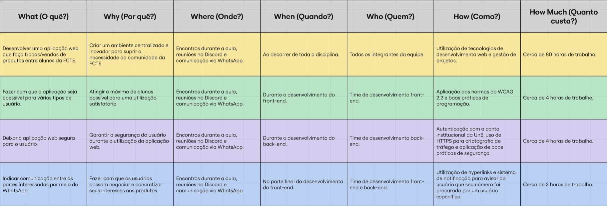

# 1.2.3. 5W2H

## Introdução

O 5W2H é uma ferramenta de planejamento e gestão que auxilia na organização de atividades, projetos e processos de maneira clara e objetiva. Seu nome faz referência às iniciais em inglês das sete perguntas fundamentais que orientam a análise:

- What (O quê?) – Define a atividade ou tarefa a ser realizada.
- Why (Por quê?) – Explica a justificativa ou motivação da ação.
- Where (Onde?) – Determina o local ou contexto de execução.
- When (Quando?) – Estabelece o período em que será realizada.
- Who (Quem?) – Identifica os responsáveis e/ou envolvidos.
- How (Como?) – Detalha o método ou forma de execução.
- How much (Quanto custa?) – Estima os recursos necessários.

No contexto deste trabalho de Arquitetura e Desenho de Software (UnB - 2025.2), a ferramenta foi aplicada para organizar as ações relacionadas ao desenvolvimento do sistema AquiTemFCTE, assegurando que a construção do projeto ocorra de forma organizada e coesa.

## Metodologia

Para a integração do modelo de gestão 5W2H, os integrantes refletiram as motivações e ideias para o projeto, utilizando a técnica como um guia para a construção da aplicação. O processo seguiu as seguintes etapas:

- **Análise dos documentos da Design Sprint**: foram revisados os materiais produzidos durante a [Design Sprint](/Base/1.1.DesignSprint.md) da disciplina Arquitetura e Desenho de Software (UnB – 2025.2), buscando identificar o cerne do projeto, de maneira a auxiliar na organização de atividades.

- **Discussão acerca dos pontos essenciais a serem comtemplados no modelo**: Os membros responsáveis argumentaram os tópicos a serem abordados na construção do artefato, considerando a análise prévia dos documentos e seus respectivos níveis de importância.

- **Implementação dos pontos**: Através das perguntas propostas pelo 5W2H, foi criada uma tabela contendo as principais informações para assegurar clareza nos objetivos, métodos de execução e responsabilidades.

### Participantes

Os participantes da elaboração do artefato estão descritos na Tabela 1 abaixo.

Tabela 1: Participantes da elaboração do 5W2H

| Matrícula   | Aluno             |
| ----------- | ----------------- |
| 23/1026302  | Caio Sabino       |
| 23/1011220  | Davi Camilo       |

## Tabela com o 5W2H

A tabela a seguir mostra os planos de ação definidos para a construção do projeto, incluindo todas as perguntas propostas pelo framework em questão:

Figura 2: 5W2H 

## Referências

> KLOCK, Ana Carolina Tomé; GASPARINI, Isabela. Um framework para projetar, desenvolver e avaliar a gamificação centrada no usuário. Joinville: UDESC, PPGCA/PPGECMT, [s.d.].

## Histórico de Versões
| Versão | Data | Descrição | Autor(es) | Revisor(es) | Detalhes da Revisão |
| -- | -- | -- | -- | -- | -- |
| 1.0 | 01/09/2025 | Criação do Documento e adição das informações do 5W2H | [Davi Camilo](https://github.com/Davicamilo23) | [Caio Sabino](https://github.com/caiomsabino) | 01/09/2025 |