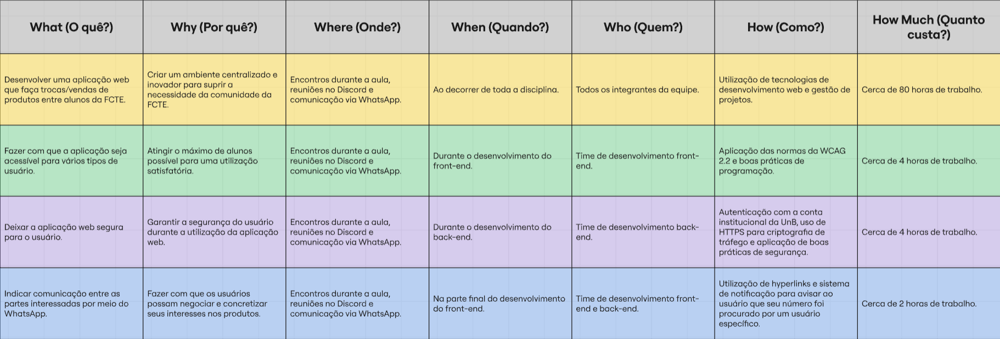

# 1.2.4. 5W2H

## Introdução

O 5W2H é uma ferramenta de planejamento e gestão que facilita a organização de atividades, projetos e processos de forma clara e objetiva, podendo ser aplicada em vários contextos, como na gamificação. Seu nome faz referência às iniciais em inglês das sete perguntas fundamentais/dimensões que orientam a análise:

- What (O quê?) – Define a atividade ou tarefa a ser realizada.
- Why (Por quê?) – Explica a justificativa ou motivação da ação.
- Where (Onde?) – Determina o local ou contexto de execução.
- When (Quando?) – Estabelece o período em que será realizada.
- Who (Quem?) – Identifica os responsáveis e/ou envolvidos.
- How (Como?) – Detalha o método ou forma de execução.
- How much (Quanto custa?) – Estima os recursos necessários.

No contexto deste trabalho de Arquitetura e Desenho de Software (UnB - 2025.2), o framework foi utilizado para estruturar as ações relacionadas ao desenvolvimento do sistema AquiTemFCTE, assegurando que o progresso do projeto ocorra de maneira organizada e coesa.

## Metodologia

Para integrar o modelo de gestão 5W2H, os integrantes refletiram sobre as motivações e ideias do projeto, utilizando a técnica como um guia para a construção da aplicação. O processo seguiu as seguintes etapas:

- **Análise dos documentos da Design Sprint**: foram revisados os materiais produzidos durante a [Design Sprint](/Base/1.1.DesignSprint.md) da disciplina Arquitetura e Desenho de Software (UnB – 2025.2) em sua fase de [Mapping](/Base/1.1.1.Mapping.md), buscando identificar e compreender os aspectos centrais do projeto.

- **Discussão acerca dos pontos essenciais a serem abordados no modelo**: os membros responsáveis discutiram os tópicos que deveriam ser incluídos na construção do artefato, considerando a análise prévia dos documentos feita na etapa anterior.

- **Implementação dos pontos**: a partir das perguntas propostas pelo 5W2H, foi criada uma tabela contendo as principais informações, buscando organizar as atividades e garantir clareza nos objetivos, métodos de execução e responsabilidades.

### Participantes

Os participantes da elaboração do artefato estão descritos na Tabela 1 abaixo.

Tabela 1: Participantes da elaboração do 5W2H

| Matrícula   | Aluno             |
| ----------- | ----------------- |
| 23/1026302  | Caio Sabino       |
| 23/1011220  | Davi Camilo       |

## Tabela 5W2H

A tabela a seguir apresenta os planos de ação definidos para a construção do projeto, incluindo todas as perguntas propostas pela ferramenta de planejamento em questão:

Figura 2: Tabela 5W2H 

## Justificativas e Senso Crítico

Foi essencial a aplicação do 5W2H para uma melhor compreensão do projeto **AquiTemFCTE**. Com a metodologia, foi possível refletir sobre as principais necessidades dos estudantes do nosso Campus (FCTE), e consequentemente, sobre como o projeto pode, a partir de funcionalidades, solucionar tais problemas. Para isso, a análise com base nas categorias do modelo ("O quê?", "Por quê?", "Onde?", "Quando?", "Quem?", "Como?" e "Quanto custa?") foi importante.

Essa ferramenta de planejamento e gestão orientou nossas ideias de desenvolvimento, sendo possível entender onde os esforços devem ser maiores, para, dessa forma, alinhar o projeto aos objetivos e necessidades dos usuários, e assim, assegurar que o produto final atenda de maneira eficaz aos desafios enfrentados pela comunidade acadêmica da UnB/FCTE.

## Comentários sobre o trabalho em Equipe

O processo de desenvolvimento do 5W2H foi feito de maneira cooperativa entre os membros responsáveis, onde os tópicos abordados na tabela foram divididos entre os integrantes, havendo uma ajuda em casos de dúvida, além de uma revisão ao final, de maneira a contemplar mais do que somente uma visão sobre cada ponto.

Com isso, o trabalho em equipe foi extremamente proveitoso, podendo não apenas aumentar a qualidade do artefato, como também fortalecer a direção tomada pela equipe para o projeto.

## Referências

> KLOCK, Ana Carolina Tomé; GASPARINI, Isabela. **Um framework para projetar, desenvolver e avaliar a gamificação centrada no usuário**. Joinville: UDESC, PPGCA/PPGECMT, [s.d.].

## Histórico de Versões

| Versão | Data | Descrição | Autor(es) | Revisor(es) | Detalhes da Revisão |
| -- | -- | -- | -- | -- | -- |
| 1.0 | 01/09/2025 | Criação do Documento e adição das informações do 5W2H | [Davi Camilo](https://github.com/Davicamilo23) | [Caio Sabino](https://github.com/caiomsabino) | 01/09/2025 |
| 1.1 | 01/09/2025 | Pequenas alterações no texto | [Davi Camilo](https://github.com/Davicamilo23) | [Caio Sabino](https://github.com/caiomsabino) | 01/09/2025 |
| 1.2 | 03/09/2025 | Adição das seções "Justificativas e Senso Crítico" e "Comentários sobre o trabalho em Equipe" | [Davi Camilo](https://github.com/Davicamilo23) | [Caio Sabino](https://github.com/caiomsabino) | 03/09/2025 |