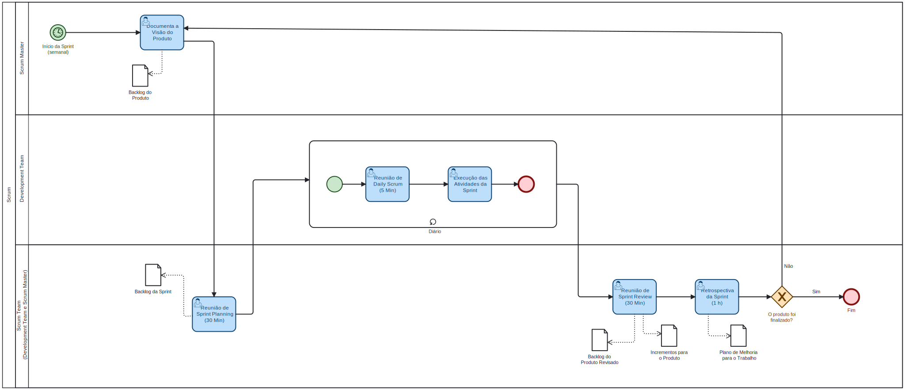

# 1.3. Módulo Modelagem BPMN

## 1.3.1 BPMN Scrum

Neste projeto, adotaremos o **Scrum** como framework para organizar, monitorar e iterar sobre o desenvolvimento das tarefas. O processo é estruturado em sprints, períodos curtos e regulares nos quais o time planeja, executa e revisa as atividades, garantindo entregas incrementais e contínua melhoria. Cada tarefa é registrada no backlog, priorizada e acompanhada por meio de reuniões diárias e cerimônias do Scrum, proporcionando transparência, colaboração e controle sobre o progresso do projeto.

Figura 1: BPMN Scrum

Fonte: Daniel Rodrigues e Lucas Guimarães

### Passos do Fluxo

1. **Documentar a Visão do Produto** – O *Scrum Master* registra a visão do produto e mantém o *Product Backlog* atualizado.
2. **Sprint Planning** – A equipe realiza a reunião de planejamento da sprint para selecionar os itens do backlog que serão trabalhados na próxima sprint. O *Sprint Backlog* é definido neste momento.  
3. **Execução da Sprint** – Durante a sprint, a equipe realiza diariamente a *Daily Scrum* para acompanhar o progresso e identificar obstáculos. As tarefas selecionadas são executadas até sua conclusão.  
4. **Sprint Review** – Ao final da sprint, a equipe apresenta os incrementos concluídos na reunião de revisão da sprint, atualizando o Product Backlog com ajustes e novas prioridades.
5. **Sprint Retrospective** – A equipe realiza a retrospectiva da sprint, avaliando o que funcionou bem e o que pode ser melhorado, gerando um plano de melhoria para o trabalho futuro.  
6. **Decisão de Finalização** – O time verifica se o produto está finalizado.
    - Se **sim**, o ciclo do projeto é encerrado.
    - Se **não**, inicia-se uma nova sprint, repetindo o ciclo.

## Referências

> SERRANO, Milene. Arquitetura e Desenho de Software – Aula BPMN Exemplos. Disponível em: [https://aprender3.unb.br/pluginfile.php/3178527/mod_page/content/2/Arquitetura%20e%20Desenho%20de%20software%20-%20Aula%20BPMN%20Exemplos%20-%20Profa.%20Milene.pdf](https://aprender3.unb.br/pluginfile.php/3178527/mod_page/content/2/Arquitetura%20e%20Desenho%20de%20software%20-%20Aula%20BPMN%20Exemplos%20-%20Profa.%20Milene.pdf). Universidade de Brasília – UnB. Brasília. Acesso em: 04/09/2025

> KAYSER, Marcos. Scrum: o que é, etapas e como aplicar a metodologia na empresa. *Scopi*. 25 maio 2022. Disponível em: [https://scopi.com.br/blog/scrum/](https://scopi.com.br/blog/scrum/). Acesso em: 04/09/2025.

---

## Histórico de Versões

| Versão | Data | Descrição | Autor(es) | Revisor(es) | Detalhes da Revisão |
| -- | -- | -- | -- | -- | -- |
| 1.0 | 04/09/2025 | Criação da imagem do BPMN e documentação  | [Daniel Rodrigues](https://github.com/DanielRogs) & [Lucas Guimarães](https://github.com/lcsgborges) | | |
